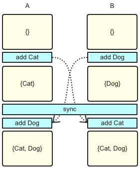
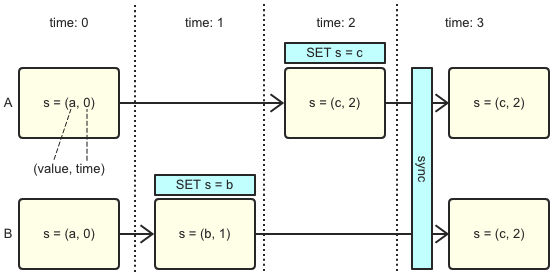
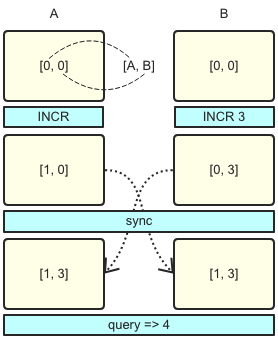
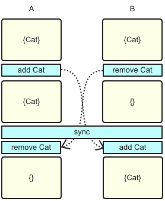
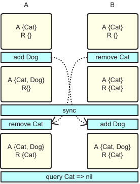
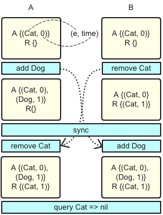

# CRDT

> 原文：[CRDT——解决最终一致问题的利器](https://yq.aliyun.com/articles/635632?utm_content=m_1000015503)

## 概述

**跨数据中心的数据同步** 是企业提升容灾能力的必备手段，对于社交、视频直播、电商以及游戏等访问规模大、业务分布广的行业，跨区域全球部署也愈发重要。

然而面对大型分布式系统, 不免要讨论 **CAP理论**，在跨区域多活的场景下如何取舍？显然 **P(网络分区) 是首要考虑因素**。其次，跨区域部署就是为了提高可用性，而且对于常见的一致性协议，不管是 2PC、Paxos 还是 raft，在此场景下都要做跨区域同步更新，不仅会降低用户体验，在网络分区的时候还会影响可用性，因此 **C必定被排在最后**。那是不是C无法被满足了呢？事实并非如此，退而求其次，最终一致也是一种选择。

`CRDT`(`Conflict-Free Replicated Data Type`) 是各种基础数据结构最终一致算法的理论总结，能根据一定的规则自动合并，解决冲突，达到强最终一致的效果。

2012年 CAP 理论提出者 Eric Brewer 撰文回顾 CAP 时也提到，`C` 和 `A` 并不是完全互斥，建议大家使用 `CRDT` 来保障一致性。自从被大神打了广告，各种分布式系统和应用均开始尝试 `CRDT`，**redislabs** 和 **riak** 已经实现多种数据结构，微软的 CosmosDB 也在 azure 上使用 CRDT 作为多活一致性的解决方案。


## CRDT简介

先简单统一一下概念和名词:

- `object`: 可以理解为“副本”
- `operation`: 操作接口，由客户端调用，分为两种，读操作 `query` 和写操作 `update`
  - `query`: 查询操作，仅查询本地副本
  - `update`: 更新操作，先尝试进行本地副本更新，若更新成功则将本地更新同步至远端副本
- `merge`: update 在远端副本的合并操作

一个数据结构符合 CRDT 的条件是 update操作 和 merge 操作需满足 交换律、结合律和幂等律。如果 update 操作本身满足以上三律，merge 操作仅需要对 update 操作进行回放即可，这种形式称为 **op-based CRDT**，最简单的例子是集合求并集。




如果 update 操作无法满足条件，则可以考虑同步副本数据，同时附带额外元信息，通过元信息让 update 和merge 操作具备以上三律，这种形式称为 state-based CRDT。让元信息满足条件的方式是让其更新保持 __单调__，这个关系一般被称为 __偏序关系__。举一个简单例子，每次 update 操作都带上时间戳，在 merge 时对本地副本时间戳及同步副本时间戳进行比对，取更新的结果，这样总能保证结果最新并且最终一致，这种方式称为 Last Write Wins：



有两点值得注意的地方：

- update 操作无法满足三律，如果能将元信息附加在操作或者增量上，会是一个相对 state-based 方案更优化的选择
- 如果同步过程能确保 exactly once的 语义，幂等律条件是可以被放宽掉，比如说加法本身满足交换律结合律但不幂等，如果能保证加法操作只回放一次，其结果还是最终一致的。

有了以上的理论基础后，我们可以看看各种数据结构如何设计，才能满足CRDT，达到最终一致。


## CRDTs一览

以下展示一些典型的CRDT数据结构的例子，每一种数据类型都会给出示意图，必要时给出伪代码说明，证明略过，有兴趣可参见[附录2]。

### Counter

counter 是最简单的例子，为了说明 state-based 和 op-based 的差异，在此分别给出两种形式的描述。

#### Op-based counter

counter 的 op-based 形式支持两种写操作：increment 和 decrement，由于加法天然满足交换律和结合律，所以非常容易实现，直接转发操作即可：


但要注意的是加法不幂等，所以同步过程中需要保证不丢不重。


#### G-Counter (Grow-only Counter)

counter 的 state-based 形式并非那么的显而易见，为了简化问题，我们先从一个只有 increment 的 counter 开始看起。

由于同步的是全量，如果每个副本单独进行累加，在进行 merge 的时候无法知道每个副本具体累加了多少，更不能简单的取一个 max 作为最终结果，比如 A做一次INCR 1 同时 B做一次INCR 2，副本全量同步之后，A 和 B 都取max 以 2 做为结果并最终一致，但正确的结果应该是 3。

所以一种可行的方式是在每个副本上都使用一个数组保留其它所有副本的值，update 时只操作当前副本在数组中对应项即可，merge 时对数组每一项求 max 进行合并，query 时返回数组的和，即为 counter 的当前结果。

```
update increment()
    let g = myID()
    P[g] := P[g] + 1
query value(): integer v
    let v = sum(P)
merge (X, Y): Z
    let Z.P[i] = max(X.P[i], Y.P[i]) (i in [0, n - 1])
```





易见 update 和 merge 均能保证单调的递增，所以 G-Counter 是 state-based CRDT。

#### PN-Counter

带有 decrement 的 state-based CRDT 也并非像 G-Counter 那样显而易见，带有减法之后，不能满足 update 时单调的偏序关系。 所以正确的方式是构造两个 G-Counter，一个存放 increment 的累加值，一个存放 decrement的累加值。


### Register

register 本质是一个 string，仅支持一种写操作 assign。并发 assign 是不存在交换律的，所以需要考虑附加上偏序关系。

#### Last-Writer-Wins Register (LWW Register)

一种简单的做法是后assign的覆盖先assign的(last write wins)，方式是每次修改都附带时间戳，update时通过时间戳生成偏序关系，merge时只取较大时间戳附带的结果。示意图前文已经给出。


### Set

Set一共有两种写操作，add 和 remove，多节点并发进行add和remove操作是无法满足交换律的, 会产生冲突：



所以必须附加一些额外信息，可以从一个只做添加的set开始看起。


#### Grow-Only Set (G-Set)

set的add操作本质上是求并，天然满足交换律、结合律和幂等律, 满足Op-based CRDT：

> 交换律: X U Y = Y U X
> 结合律: (X U Y) U Z = X U (Y U Z)
>
> 幂等律: X U X = X


#### 2P-Set

考虑删除操作，思路和 PN-Counter 一致，使用两个G-Set, set A只负责添加，对于从set A中remove的元素不做实际删除，只是复制到set R中，如下：



query时如果元素在set A且不在set R中，则表示该元素存在。

```
query lookup(e): bool b 
    let b = (e in A && e not in R)
```

由于只同步操作，且两个set只添加不减少，易证其为 op-based CRDT。但 2P-Set 十分不实用，一方面已经被删除的元素不能再次被添加，一方面删除的元素还会保留在原set中，占用大量空间。

#### LWW-element-Set

为了解决删除元素不能再次添加的问题，可以考虑给 2P-Set 中 A 和 R 的每个元素加一个更新时间戳，其它操作保持不变，只要在查询的时候做如下处理：

```
query lookup(e): bool b
    let b = (t1 < t2): (e, t1) in A && (e, t2) not in R  
```



一个更优化的实现是不要R集合，而A集合中每一个元素除了维护一个更新时间戳之外，还有一个删除标志位。

#### Observed-Remove Set (OR-Set)

还有一种想法不太相同的设计，核心思想是每次add(e)的时候都为元素e加一个唯一的 tag，remove(e) 将当前节点上的所有e和对应的tag都删除，这样在remove(e)同时其它节点又有并发add(e)的情况下e是能够最终保证添加成功，此种语义称为add wins。如图，A上做remove e时仅有A一个tag，所以在C收到A同步过来的remove时，只删除tag A，tag B保留e在C上仍然存在，最终ABC三个节点是一致的，都有e及tag B。


虽然在remove时看似存在并不能保证交换律的删除操作出现，但删除的元素是全局唯一的，所以并不破坏语义，故仍然是为CRDT。

`OR-Set` 相对来说是一种比较实用的结构，但实现上仍然有几个问题要解决：

- 重复add和remove的场景下会产生大量的tag，空间需要优化
- 在考虑空间优化的前提下如何生成全局唯一的tag
- 需要考虑如何进行垃圾回收

学术界有多篇论文都是在探讨对此种算法的优化。但 `OR-Set` 在实践中最严重的问题是一旦同步通道出现延迟或者中断，很可能出现用户认为早已删除掉的字段在同步恢复之后再次出现。从工程实践角度讲，更优化的方案是使用时间戳作为 `unique tag`，好处是易保证唯一性，同时自带单调递增属性，重复删除添加时不会生成大量tag。

## 附录

1. CRDT: https://hal.inria.fr/inria-00609399/document
2. CRDT tech report: https://hal.inria.fr/file/index/docid/555588/filename/techreport.pdf
3. Eric Brewer: https://www.infoq.com/articles/cap-twelve-years-later-how-the-rules-have-changed
4. redislabs, Developing Applications with Geo-replicated CRDBs on Redis Enterprise Software(RS): https://redislabs.com/redis-enterprise-documentation/developing/crdbs/
5. riak: https://docs.basho.com/riak/kv/2.0.0/developing/data-types/
6. cosmosDB: https://docs.microsoft.com/en-us/azure/cosmos-db/multi-region-writers


## Read More

- [分布式CRDT模型](https://www.jdon.com/artichect/crdt.html)